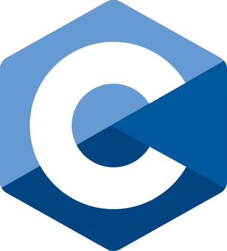

# C I: Conhecendo a linguagem das linguagens

> Jogo de adivinhação construído em C no curso  <a href="https://cursos.alura.com.br/course/introducao-a-programacao-com-c-parte-1">C I: Conhecendo a linguagem das linguagens</a> da alura

## 🛠️ Construído com

🔹<a href="https://www.w3schools.com/c/c_intro.php/">
  
    - C
</a>

## 📜 Certificado

## 👤Contatos
🔹<a href = "mailto:contato.miguelretroz@gmail.com" target="_blank">
  
  contato.miguelretroz@gmail.com
</a>

🔹<a href="https://www.linkedin.com/in/miguelretroz/" target="_blank">
  
   Miguel Retroz
</a>

🔹<a href = "https://www.instagram.com/miguel.retroz/" target="_blank">
  
  @miguel.retroz
</a>